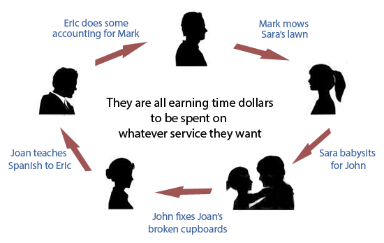

Under the metropolitan monetary market economy context, the negative impact of crises can be extremely pronounced among those who do not have sufficient monetary and social resources due to systemic inequality. To address this issue, many have suggested that timebank can be a potential complementary to the existing system of monetary market economy. Time banks are a form of alternative currency that uses the unit time of labour as the unit of value. By encouraging local economic exchange, generating socioeconomic inclusion and accumulating community connections, the time bank model can potentially be a viable complement to the dominant market economy structure that helps people through crises.

However, despite its great socioeconomic potential, time banks are not a prevalent practice and only represent a small proportion of the entire alternative currency movement. And just like many other startups, many time banks have faced great difficulty taking off, or sustaining their momentum after several years of operation. One of the possible reasons for this phenomenon is that the success of a time bank initiative is dependent on various internal and external factors. Only when a time bank initiative has met the essential conditions for it to succeed could it deliver its socioeconomic promises. Unfortunately, the literature that discusses the factors that influence the success of time bank has been limited. This project seeks to find out the factors that may influence the operational vibrancy of time banks from a quantitative percpective. This project will also shed light into this widely mentioned yet rarely studied section of the alternative economy movement, and probably break the trail for future researches of both qualititative and quantitative nature in this area.