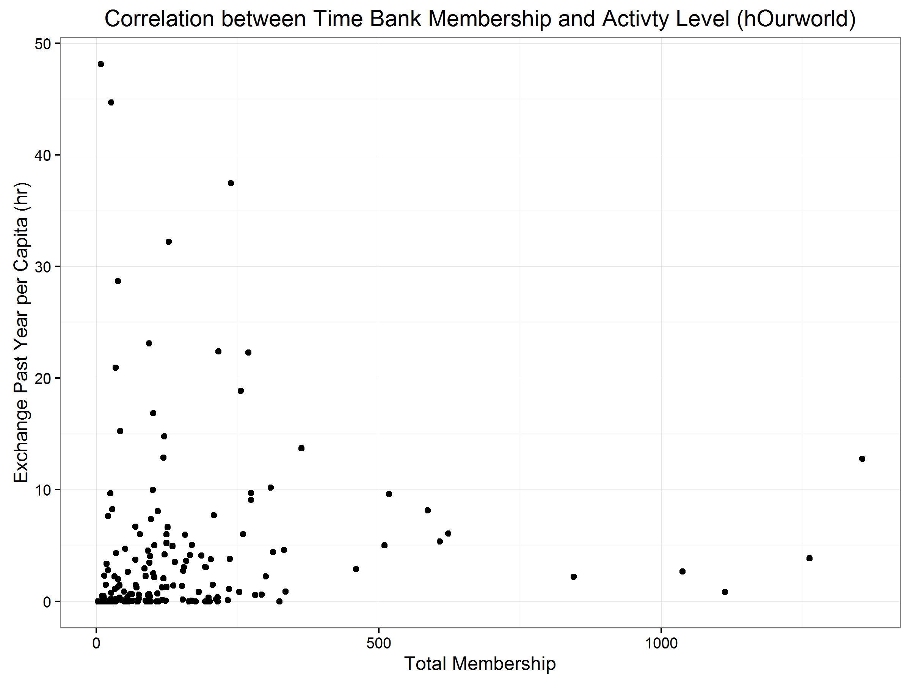
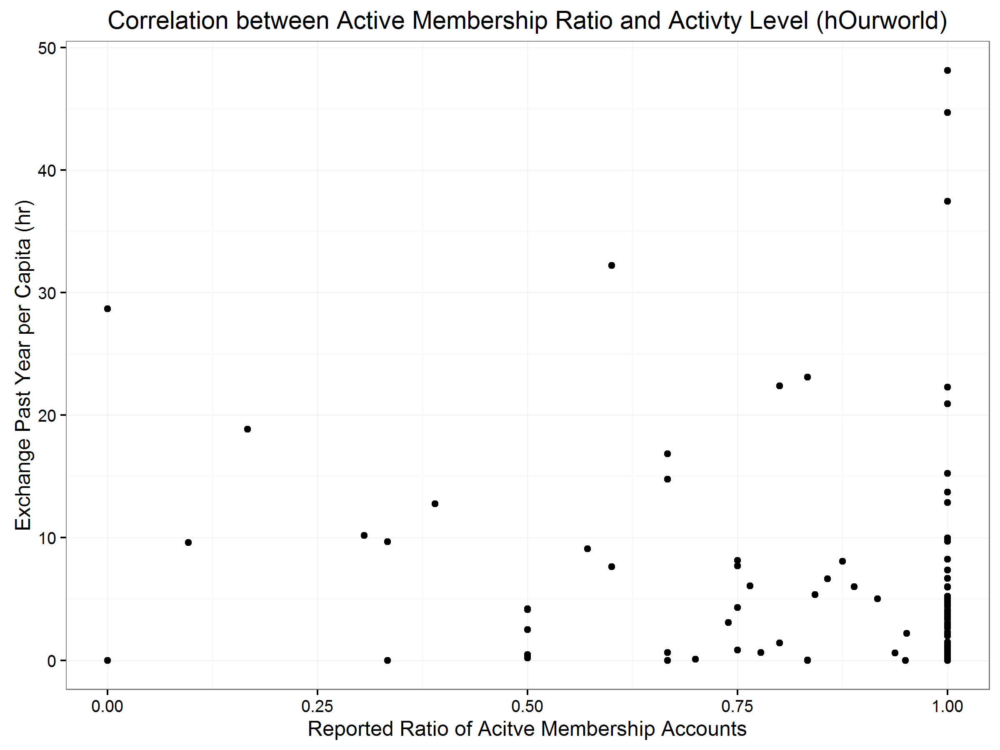
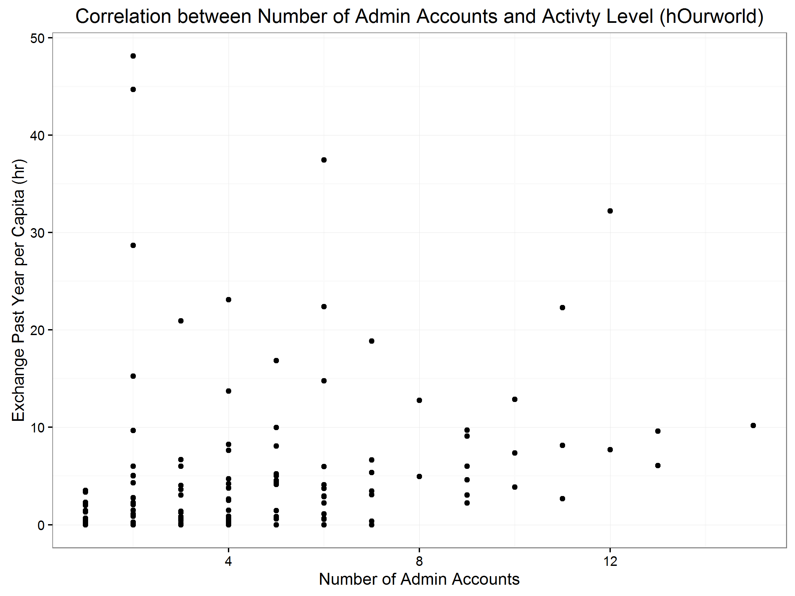
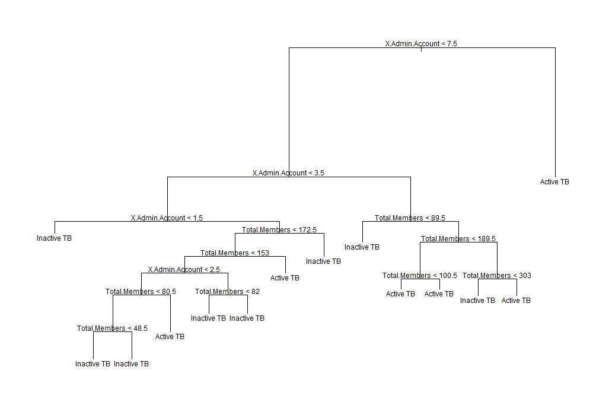
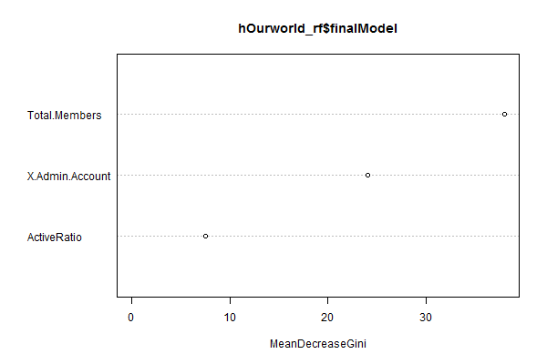

### Theoretical Framework
A number of quantitative factors would in theory affect the activity level of a timebank initiative, namely: the size of its membership size, the ratio of active members, and the number of admin accounts.

First, a large membership in theory would encourage more active exchanges among time bank members due to the higher number of exchange requests being made as well as the higher diversity of skills and labours offered. Ideally, this would promote vibrant time credit exchange among members, thereby increases the staying power of the initiative. And with the help of the software platform, a larger membership should not have a positive correlation with the labor of time bank coordinators.

Second, a high ratio of active membership participation would in theory lead to a more vibrant time bank. This is because a low membership participation rate can seriously jeopardize the matchmaking of the time bank software system, undermining the user experience of time bank members while significantly increasing the workload of coordinators. This is because when a time bank member makes an exchange request, the software system will automatically generate a short list of individuals who offer relevant skills on their user profile. This gives the requesting individual a guideline of who he or she should contact with and seek help from. However, when the percentage of active members is low, the majority of the options offered on that list will not be reachable. This would be extremely frustrating for the individual who make the request.

Last but not least, time banks with more admin accounts would in theory mean that there are more time bank coordinators participating in the management and advocacy of the initiative, and is therefore a good indicator of a higher institutional capacity. This means that the coordinator team would be more effective and responsive in addressing the needs and concerns of time bank members. This in return would improve the user experience of time bank members, giving them more incentive in participating time credit exchanges.

### Data visualizing and modelling
By using the data provided by hOUrworld, this project tries to see if the correlation between the three factors and the operational vibrancy of time banks coincide with our theoretical deduction. The activity level of a time bank is measured by the hour exchange per membership (exchange per capita) in the past year (365 days). Because many time banks are startups with minimal exchange, this analysis only focuses on time banks that are launched before 2016 and at least have 10 hrs of exchange in history. The result is as following:

Based on these diagrams, it is clearly evident that there is not a visible or statistically significant correlation between the activity level of time banks with any of the three variables we have identified. The outliers are both numerous and extreme.

Given the obvious inadequecy of regression model, this project also incorporates a decision tree to understand how these three factors may influence the performance time banks from a more detailed perspective. Any time bank with an exchange per capita lower or equals to 2 hours in the past year is identified as an inactive time bank. Those with an exchange rate higher than 2 hours is identified as an active time bank. Based on this premise, the decision tree is as following:

Based on the decision map, it seems that time banks with a higher number of administrator accounts are almost always favoured over time banks with a smaller number of administrator accounts in having an active institution status. The ratio of active membership has a minimal influence over whether a time bank initiative is active or not is minimal. The impact of the membership size, however, is more complicated. As a rule of thumb, small time banks with a membership of 48 or less tend to be inactive, while the active level of larger time banks is often partially determined by the number of administrator accounts based on this decision tree model. Based on random forest test, this decision tree model has a **class error** of **0.432** for active time banks and a **class error** of **0.35** for inactive time banks. Therefore, caution need to be taken when using this model as a tool for prediction.

The mean decrease gini of each variable is as following:

Xu, Haitong 2016